# Deploy ERC20 Contract

> [!TIP]
> You can conduct this lab using the [Remix IDE](https://remix.ethereum.org/) for fast startup with zero configuration, or run it locally using [Hardhat](https://hardhat.org/) for a more realistic development environment. This will require using WSL and some additional configuration steps. 

Detail about the ERC20 standard can be found at: https://ethereum.org/en/developers/docs/standards/tokens/erc-20/. Explain in the simple term, it is a constract that contains 9 basic functions:

| **Function**                                       | **Type** | **Purpose**                     | **Description & Example**                                                                                                                                                                              |
| ---------------------------------------------------------- | -------- | ------------------------------- | ------------------------------------------------------------------------------------------------------------------------------------------------------------------------------------------------------ |
| `name()`   | `view`                               | Return token full name             | Returns the token's **full name** (e.g., `"USD Coin"`).<br>📌 Used in wallets and explorers.                       |
| `symbol()`   | `view`      | Return token ticker symbol         | Returns the **symbol** (like stock tickers).<br>📌 Example: `"USDC"`, `"DAI"`, `"UNI"`.                            |
| `decimals()` | `view`        | Decimal precision           | Defines how many **decimal places** the token supports.<br>📌 If `decimals = 18`, then `1 token = 10^18` units.    
| `totalSupply()`                                            | `view`   | Provides total supply of tokens | Returns how many tokens exist in total. <br>🔸 *Ex:* If a token has 1 million total tokens, `totalSupply()` returns `1,000,000`.                                                                       |
| `balanceOf(address _owner)`                                | `view`   | Check balance of an account     | Returns how many tokens a given address owns. <br>🔸 *Ex:* `balanceOf(0xAbC...)` might return `1000` tokens.                                                                                           |
| `transfer(address _to, uint256 _value)`                    | `public` | Directly send tokens            | Transfers `_value` tokens from **msg.sender** to `_to`. <br>🔸 *Ex:* Alice sends 100 tokens to Bob → `transfer(Bob, 100)`                                                                              |
| `transferFrom(address _from, address _to, uint256 _value)` | `public` | Transfer on behalf of another   | Allows an **approved address** (like a contract or user) to transfer tokens from `_from` to `_to`. <br>🔸 *Ex:* Uniswap calls `transferFrom(Alice, Pool, 300)` to take tokens after Alice approved it. |
| `approve(address _spender, uint256 _value)`                | `public` | Authorize spending              | Allows `_spender` to spend up to `_value` tokens from **your** account. Used for delegated spending. <br>🔸 *Ex:* Alice approves Uniswap to spend 500 tokens → `approve(Uniswap, 500)`                 |
| `allowance(address _owner, address _spender)`              | `view`   | Check remaining approved tokens | Shows how many tokens `_spender` is still allowed to spend from `_owner`. <br>🔸 *Ex:* `allowance(Alice, Uniswap)` returns `200`, meaning Uniswap can still spend 200 more tokens from Alice.          |

And two events:

| **Event**                                       | **Type** | **Purpose**                     | **Description & Example**                                                                                                                                                                              |
| ---------------------------------------------------------- | -------- | ------------------------------- | ------------------------------------------------------------------------------------------------------------------------------------------------------------------------------------------------------ |
| `Transfer`                                                 | `event`  | Log token transfer              | Emitted when tokens are transferred (`transfer()` or `transferFrom()`). Used by wallets and block explorers to track transactions.                                                              |
| `Approval`                                                 | `event`  | Log approval of allowance       | Emitted when an `approve()` call is made. Helps dApps and wallets show which contracts have permission to spend tokens.                                                                  |

That is enough for the theory, now we will write the contract code. Let try to write the code and deploy an Remix IDE VM first:

Overview about the project structure:

```plaintext
Lab_02/
├── contracts/
│   ├── Group13Token.sol          # ERC-20 token definition contract
│   └── Group13TokenSale.sol      # Token sale contract with tiered pricing
│ 
├── scripts/ (only need if run locally)
│   └── deploy.js                 # Script to deploy the contracts
│ 
├── test/
│   └── Group13TokenSale_test.js  # Unit tests for the token sale contract
│ 
├── hardhat.config.js             # Hardhat configuration file (only need if run locally)
├── README.md                    
└── Requirement.md                # Requirements for the Lab 02
```

## 1. Token definition contract

Start with the contract that defines the ERC20 token: (the source code can be found in [this file](contracts/Group13Token.sol) ):

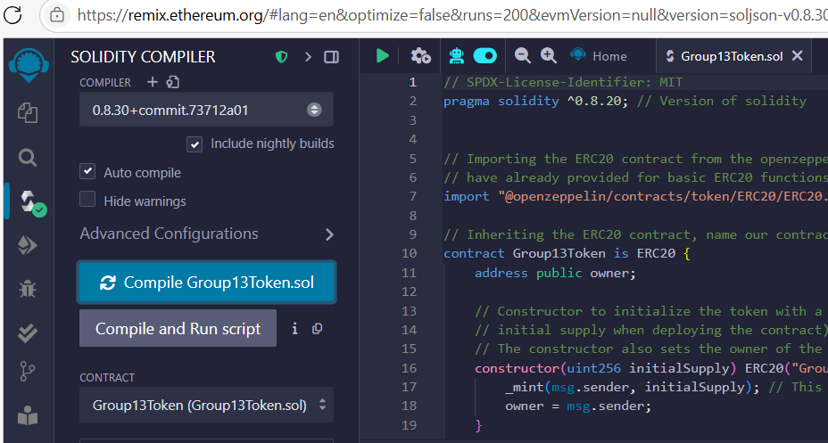
*Code compiled successfully*

Now deploy this token contract to the Remix IDE VM. Beside the `Deploy` button, we need to provide initial values for the constructor parameters, as in our code, it would be the ` initialSupply` variable. We will init with, let's say 10 tokens.

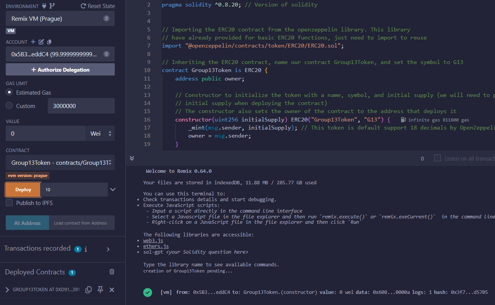
*Deploy the contract with initial supply, make sure to choose the right contract to deploy, in this case it is `Group13Token`. The account that click `Deploy` will be the owner of the contract and will have all the tokens in its balance, in this case the owner is 0x5B3...*

Afer deploying the contract, we will see the contract address in the `Deployed Contracts` section. Pay attention to this constract address since this is also the address of this token and we will need to use this in later steps, especially when we create the token sale contract.

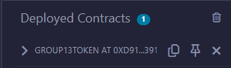

We can now test some functions/view variables of the token contract, such as:

- Check the name, decimals, symbol, owner, totalSupply:

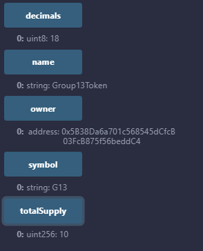


- Check balanceOf function:

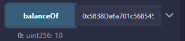

As we mentioned before, the owner of the contract will have all the tokens in its balance, so the balance of the owner should be equal to the total supply, which is 10 tokens in this case.

- Check the mint function:

Try to mint more token using mint function with parameter `(owner_address, 10)` to create 10 more tokens for the owner.

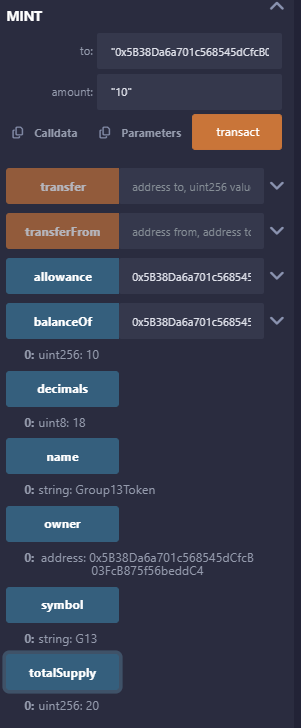

Notice that when re run the totalSupply function, it should return 20 tokens.

- Check the transfer function:

Switch to a second address and copy its address, it act as the receiver of the transfer.

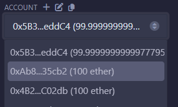

The receiver address will be `0xAb8..`. Switch back to the owner account (the one that deployed the contract) and use the `transfer` function  with paremeters `(receiver_address, 1)` to send 1 tokens to the receiver address.

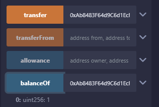

See that the balance of the reveiver address is now 1 token, and then check the balance of the owner, it should be 19 tokens now.

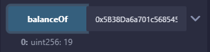

## 2. Token Sale Contract

Okay, after successfully creating our token, the next step is to implement the token sale contract, ensuring it adheres to the constraints specified in the [Requirement.md](Requirement.md):

The sourcode for the token sale contract can be found in [this file](contracts/Group13TokenSale.sol). To deploy this, click on the file, choose the `Group13TokenSale` contract. This constract requires one parameter in the constructor, which is the address of the token contract we just deployed, copy the address of the token contract from the previous step and paste it into the constructor parameter field.

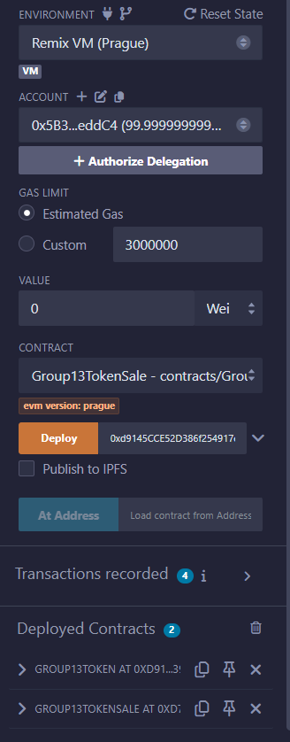

See that we now have two contracts in the `Deployed Contracts` section, one is the token contract and the other is the token sale contract.


Check some variables of this contract:

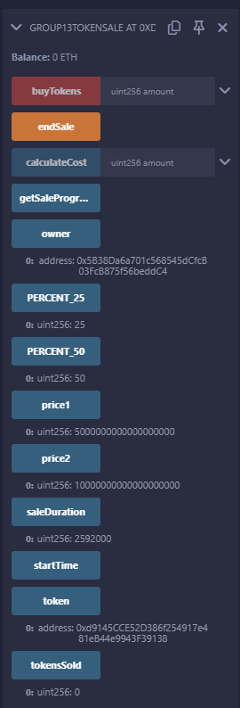

In the code, we specify the `price1 = 5 ether`, with ether keyword is just a unit conversion to wei. Solidity uses wei as its base, so the price will be display as 5 * 10^18 wei, which as you see in the image, is 5000000000000000000.


Now switch back to the owner account (the one that deployed the token contract) and transfer some tokens to the token sale contract address. This is necessary so that the token sale contract can sell those tokens to other users.

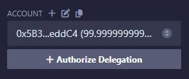

Copy the address of the token sale contract from the `Deployed Contracts` section, and then use the `transfer` function of the token contract to transfer 10 tokens to the token sale contract address.

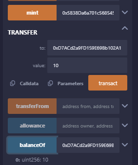

Check the balance of the token sale contract address, it should be 10 tokens now. From now on, users can buy tokens from this contract. Let switch to a different account that is not the owner of the token sale contract, for example, `0xAb8...` that we used before.

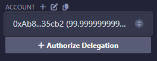

Then use the `buyTokens` function to buy tokens from the token sale contract. This function requires one parameter, which is the amount of toekn you want to buy. The price is 5 ether for 1 token (for the first 25z%), 10 ether for the next 25% as mentioned in the sale contract.

Change the value section to 5 ether to send 5 ether to include 5 eth in the transaction.

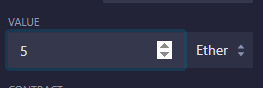

Then buy 1 token:

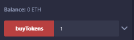

Check the variable tokensSold, it should be 1 token now:

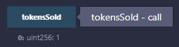

Then use the `balanceOf` function of the token contract to check the balance of the account that just bought the token, it should be adding one more token to the balance of the account:

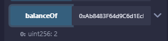

Previously when we test the transfer function of the token contract, we used the owner account to transfer 1  token to this second account, and now we have just buy 1 tokens, so the balance of this account should be 2 tokens.

Our sale contract also include a `calculateCost` function that can be used to calculate the cost of buying a certain amount of tokens. To total amount of tokens as we create in the token contract step is 20 tokes, so:

- Buying less then 25% of 20, let say 4 tokens, the cost should be 4 * 5 ether = 20 ether:

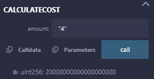

- From 25%, let say 5 tokens, the cost should be 4 * 5 ether + 1 * 10 ether = 30 ether:

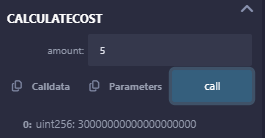

- Or 6 tokens, the cost should be 4 * 5 ether + 2 * 10 ether = 40 ether:

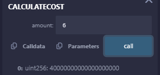

Now let's test for other constraints in the requirement:

- Cannot buy more than 50% of the total supply:

Switch to the account not owner, try to buy 11 tokens, the price will be 4 * 5 ether + 7 * 10 ether = 90 ether:

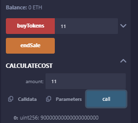

Enter enough ether:

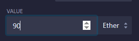

This should return an error like this indicate that the amount of tokens you are trying to buy is more than 50% of the total supply:

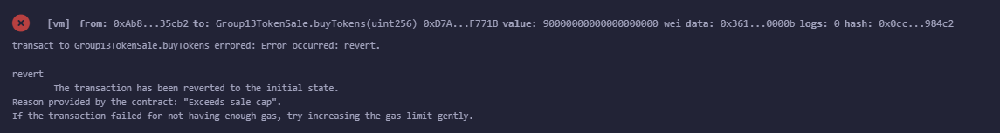

For a more comprehensive, automated testing, see our unit test file [here](test/Group13TokenSale_test.js).

The expected output of the test should be like this:

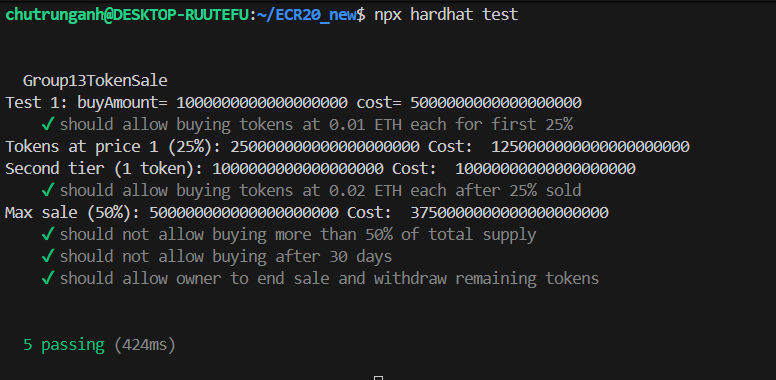


# Deploy to Sepolia Testnet

Before deploy, mofidy the sale contract a little bit, commnet out two these lines:

```solidity
uint256 public price1 = 5 ether;  // Price per token for the first 25% of tokens
uint256 public price2 = 10 ether; // Price per token for the remaining tokens
```

The requirement specifiy that first 25% is 5 ether and next 25 % is 10 ether, that is oke to deploy on local,. Howevert, I want to deploy these two contract to the sepolia testnet, I will change the ratio a little bit, since sepolia testnet only give you 0.05 ETH a day for testing. Therefore, we can do not have the ETH to buy with 5 ether, 10 ether as current ration, let change it to 0.0005 ether and 0.001 ether. Uncomment these two lines:

```solidity
uint256 public price1 = 0.0005 ether;  // Price per token for the first 25% of tokens
uint256 public price2 = 0.001 ether; // Price per token for the remaining tokens
```

To deploy you need the API key ...., place it in the env file

Now we can deploy the contract to the Sepolia testnet with command: (check the deployment script at the [deploy.js](scripts/deploy.js) file)

```bash
npx hardhat run scripts/deploy.js --network sepolia
```

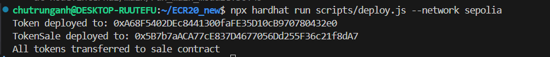

Try to import this token in the metamask wallet (use the first address show in the image above, which is token contract). Choose sepolia testnet in the metamask wallet, then click on `Import tokens`, paste the token address, it should be like this:


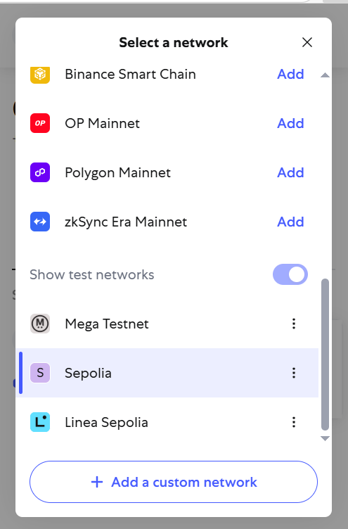

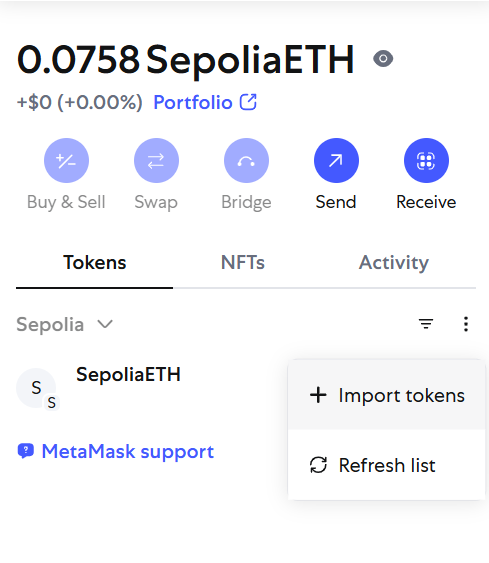

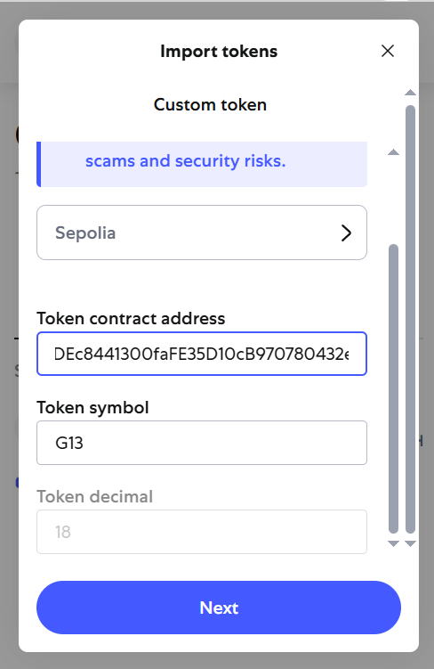

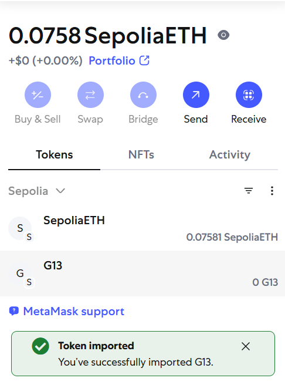


Go to https://sepolia.etherscan.io/

Currently still meet issue with verify the contract on sepolia etherscan, may be try this agin later when I have more time....


