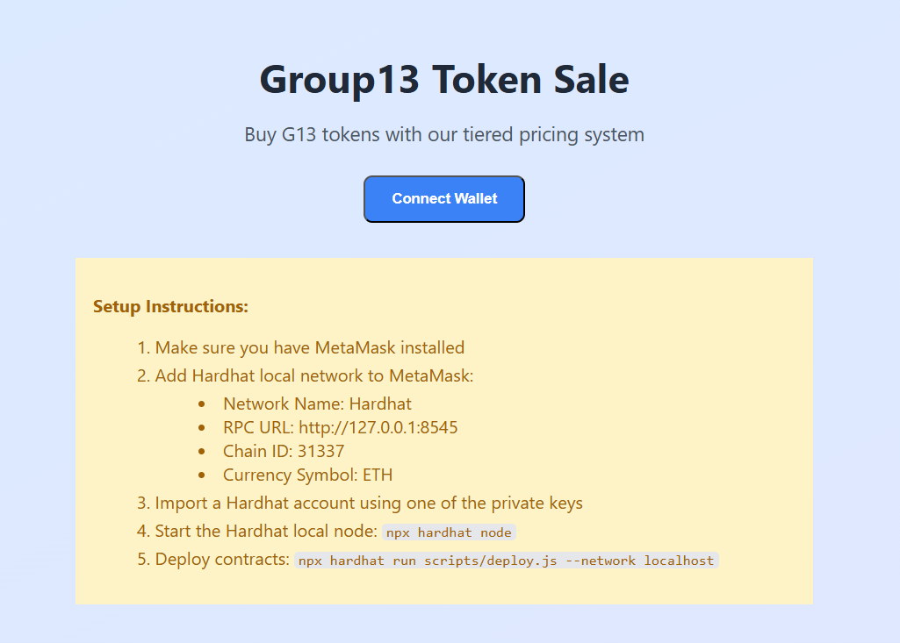

# What we will do in this lab

Recall from the previous lab (Lab 02), we have created a simple ERC20 token contract with some sell constraints as follows:

- **Tiered Pricing**: First 25% of tokens cost 5 ETH each, remaining tokens cost 10 ETH each
- **Sale Cap**: Maximum 50% of total supply can be sold
- **Duration**: 30-day sale period
- **Automatic Refunds**: Excess ETH is automatically refunded

We have successfully run and tested the contract Remix online IDE (Also tried to deploy against the Sepolia testnet but still facing some issues). In this lab, I will:

- Deploy the ERC20 token contract to a local Hardhat network
- Make the UI web interface to interact with the contract
- Rewrite contracts to align with new [Lab 03 Requirements](/Requirement_Lab03.md)

# Deploy ERC20 Contract with Hardhat and Test UI

In the previous lab, I have deploy my contracts in Remix online IDE, but now I will deploy it to a local Hardhat network. The steps are as follows:

> [!NOTE] Prerequisites to run this lab:
> - Node.js (v22 or higher) 
> - MetaMask browser extension


## Step 1: Start Hardhat Local Network

Open a terminal and run:
```bash
cd /home/chutrunganh/Blockchain-and-Applications-IT4527E/Lab_03 # Replace with your actual path
npm install              # Install dependencies
npm run compile          # Compile contracts
npm run node             # Start local Hardhat network
```

This will start a local Ethereum blockchain using Hardhat. This simulates a blockchain locally so you can test and deploy contracts quickly and safely. You should see output like:
```
Started HTTP and WebSocket JSON-RPC server at http://127.0.0.1:8545/

Accounts
========

WARNING: These accounts, and their private keys, are publicly known.
Any funds sent to them on Mainnet or any other live network WILL BE LOST.

Account #0: 0xf39Fd6e51aad88F6F4ce6aB8827279cffFb92266 (10000 ETH)
Private Key: 0xac0974bec39a17e36ba4a6b4d238ff944bacb478cbed5efcae784d7bf4f2ff80

Account #1: 0x70997970C51812dc3A010C7d01b50e0d17dc79C8 (10000 ETH)
Private Key: 0x59c6995e998f97a5a0044966f0945389dc9e86dae88c7a8412f4603b6b78690d

Account #2: 0x3C44CdDdB6a900fa2b585dd299e03d12FA4293BC (10000 ETH)
Private Key: 0x5de4111afa1a4b94908f83103eb1f1706367c2e68ca870fc3fb9a804cdab365a

Account #3: 0x90F79bf6EB2c4f870365E785982E1f101E93b906 (10000 ETH)
Private Key: 0x7c852118294e51e653712a81e05800f419141751be58f605c371e15141b007a6

Account #4: 0x15d34AAf54267DB7D7c367839AAf71A00a2C6A65 (10000 ETH)
Private Key: 0x47e179ec197488593b187f80a00eb0da91f1b9d0b13f8733639f19c30a34926a

WARNING: These accounts, and their private keys, are publicly known.
Any funds sent to them on Mainnet or any other live network WILL BE LOST.
```

From the outout, we clearly see that the network is running on `http://localhost:8545` and we have several test accounts. I have limits to just create 5 test accounts, each is inited with 10,000 ETH each, for detail, see my [`hardhat.config.js`](./hardhat.config.js) file.

> [!NOTE]
> Keep this terminal running!

## Step 2: Deploy Contracts

Open a new terminal and run:
```bash
cd /home/chutrunganh/Blockchain-and-Applications-IT4527E/Lab_03
npm run deploy:local
```

This will deploy your smart contracts (ERC-20 + Token Sale) to the hardhat local network. The `deploy:local` script runs the `scripts/deploy.js` file as defined in the `package.json` file. To view more about the deployment process, you can check the [`deploy.js`](./scripts/deploy.js) file. Anywahy, you should see output like this:

```
chutrunganh@DESKTOP-RUUTEFU:~/Blockchain-and-Applications-IT4527E/Lab_03$ npm run deploy:local

> deploy:local
> npx hardhat run scripts/deploy.js --network localhost

Deploying contracts with the first account...
Account address: 0xf39Fd6e51aad88F6F4ce6aB8827279cffFb92266
Account balance: 10000.0

Deploying Group13Token...
✅ Group13Token deployed to: 0x5FbDB2315678afecb367f032d93F642f64180aa3

Deploying Group13TokenSale...
✅ Group13TokenSale deployed to: 0xe7f1725E7734CE288F8367e1Bb143E90bb3F0512

Transferring 50000.0 tokens to sale contract...

Adding initial ETH liquidity...
✅ Added 100 ETH initial liquidity

Deployment Summary:
==================
Owner Address: 0xf39Fd6e51aad88F6F4ce6aB8827279cffFb92266
Token Contract: 0x5FbDB2315678afecb367f032d93F642f64180aa3
Sale Contract: 0xe7f1725E7734CE288F8367e1Bb143E90bb3F0512

Initial Setup:
- Total Supply: 100000.0 tokens
- Tokens for Sale: 50000.0
- Initial ETH Liquidity of contract: 100 ETH

✅ Deployment info saved to: /home/chutrunganh/Blockchain-and-Applications-IT4527E/Lab_03/frontend/deployment.json
```
This performs actions as configured inside the [deploy.js](./scripts/deploy.js) script, which deploys two contracts:

- `Group13Token`: Your custom ERC-20 token contract address.
- `Group13TokenSale`: Token sale contract that manages pricing and ETH exchanges on the `Group13Token`. 

Then performs some initial setup:

- Takes the first account (the deployer) provided by Hardhat as the owner of the contracts.
-  Moves sale-allocated tokens to the sale contract, in this case transfer 500,000 G13 tokens (50% of total supply).
- Adds initial ETH liquidity to the sale contract (100 ETH in this case).


<!-- ### Step 3: Configure MetaMask

1. **Add Hardhat Network:**
   - Open MetaMask
   - Click on the network dropdown (usually shows "Ethereum Mainnet")
   - Click "Add network"
   - Fill in:
     - Network Name: `Hardhat`
     - New RPC URL: `http://127.0.0.1:8545`
     - Chain ID: `31337`
     - Currency Symbol: `ETH`
   - Click "Save"

2. **Import Test Account:**
   - Click on the account icon in MetaMask
   - Select "Import Account"
   - Enter one of the private keys from Step 1 (e.g., `0xac0974bec39a17e36ba4a6b4d238ff944bacb478cbed5efcae784d7bf4f2ff80`)
   - Click "Import"

3. **Switch to Hardhat Network:**
   - Make sure MetaMask is connected to the "Hardhat" network you just added -->

## Step 3: Start Web Interface

Open a third terminal and run:
```bash
cd /home/chutrunganh/Blockchain-and-Applications-IT4527E/Lab_03
npm run frontend
```
This will start the NextJS web interface for interacting with your token sale contract. Open your browser and go to: http://localhost:3000

Then, it will require you to connect your MetaMask wallet (you should already installed this browser extension). Click "Connect Wallet" and approve the connection.



## Step 4: Test the Token Sale

1. **Connect Wallet:**
   - Click "Connect Wallet" on the web interface
   - Approve the connection in MetaMask

2. **Buy Tokens:**
   - Enter the amount of tokens you want to buy (e.g., `10`)
   - Check the estimated cost
   - Click "Buy Tokens"
   - Confirm the transaction in MetaMask

3. **Test Different Scenarios:**
   - Buy small amounts (under 25% of total supply) - should use 5 ETH per token
   - Buy larger amounts - should use mixed pricing (5 ETH for first 25%, 10 ETH for remainder)
   - Check your token balance after each purchase


----## Still testing

5. **Configure MetaMask:**
   - Add Hardhat local network:
     - Network Name: Hardhat
     - RPC URL: http://127.0.0.1:8545
     - Chain ID: 31337
     - Currency Symbol: ETH
   - Import one of the test accounts using the private keys shown in the terminal when you ran `npm run node`

### Testing the Contracts

The web interface allows you to:
- View token and sale contract information
- Check your token and ETH balances
- Buy tokens with the tiered pricing system
- See real-time transaction status


