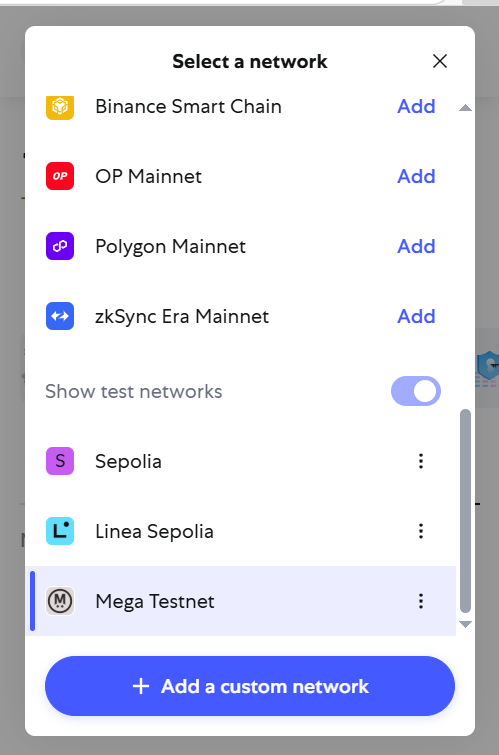
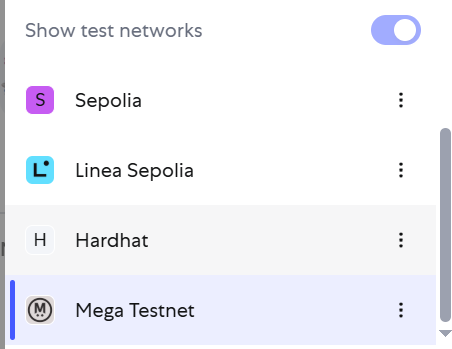
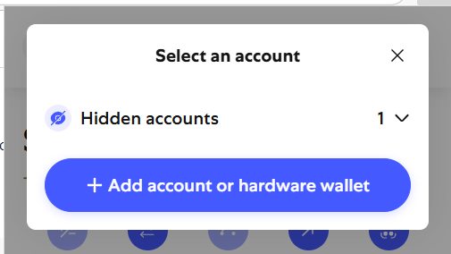
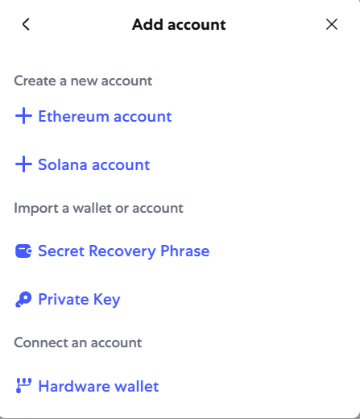
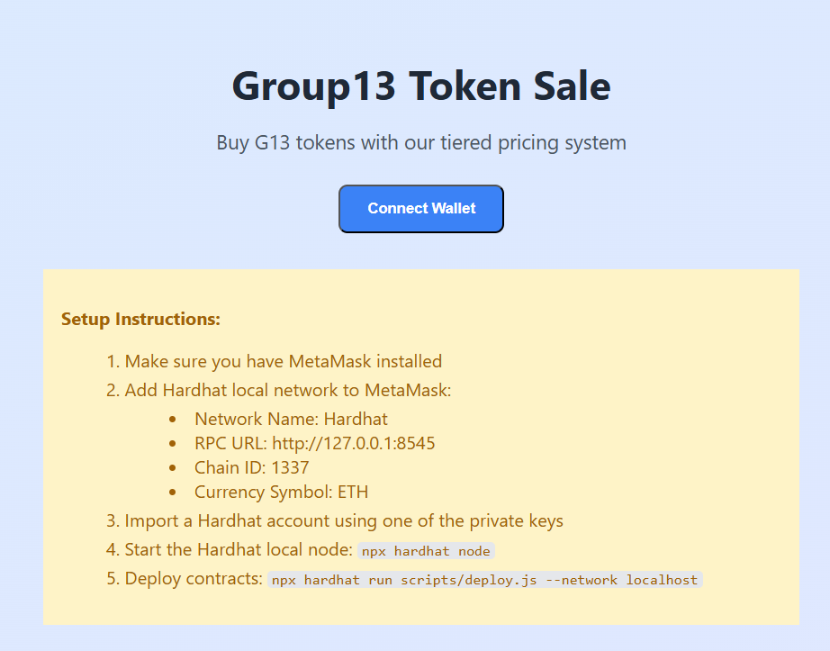
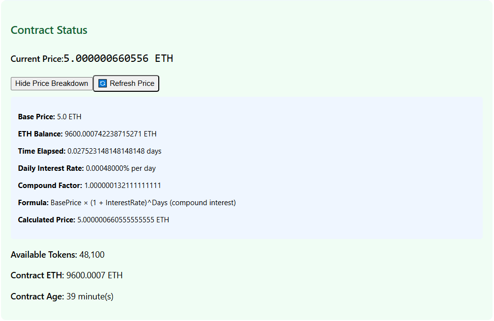
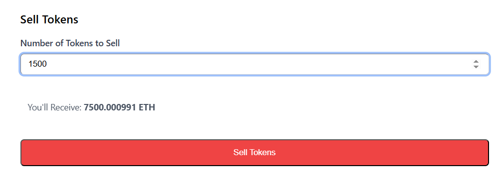
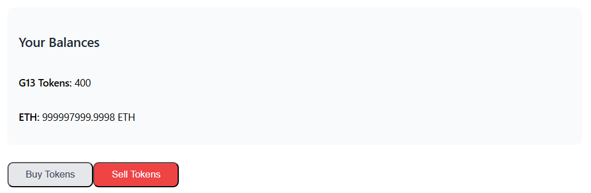

# Lab 3: Selling and buying the ERC20 token

**The original and more readable Markdown version of this report can be found at the following link: https://github.com/chutrunganh/Blockchain-and-Applications-IT4527E/tree/master/Lab_03**

# 1. What we will do in this lab

Recall from the previous lab (Lab 02), we have created a simple ERC20 token contract with some sell constraints as follows:

- **Tiered Pricing**: First 25% of tokens cost 5 ETH each, remaining tokens cost 10 ETH each
- **Sale Cap**: Maximum 50% of total supply can be sold
- **Duration**: 30-day sale period
- **Automatic Refunds**: Excess ETH is automatically refunded

We have successfully run and tested the contract Remix online IDE (Also tried to deploy against the Sepolia testnet but still facing some issues). In this lab, I will:

- Deploy the ERC20 token contract to a local Hardhat network
- Make the UI web interface to interact with the contract
- Rewrite contracts to align with new [Lab 03 Requirements](/Requirement_Lab03.md) which:

   - Allow others to buy token from the sale contract
   - Allow the owner to sell tokens back to the sale contract
   - The token price will be calculated as: `price = basePrice* (1 + interest rate) ^ (days since sale started)`

      This is same as the formula of compound interest, where:
      - `basePrice` is the initial price of the token, the requirement is to set it to 5 ETH
      - `interest rate` is the interest rate applied to the token price, equal amount of ETH in the sale contract divided by 2*10<sup>9</sup>
      - `days since sale started` is the number of days since the sale contract was deployed 

# 2. Deploy ERC20 Contract with Hardhat and Test UI

In the previous lab, I have deploy my contracts in Remix online IDE, but now I will deploy it to a local Hardhat network. The steps are as follows:

> [!NOTE] 
> Prerequisites to run this lab:
> - Node.js (v22 or higher) run in WSL or Linux environment
> - MetaMask browser extension


## Step 1: Start Hardhat Local Network

Open a terminal and run:
```bash
cd /home/chutrunganh/Blockchain-and-Applications-IT4527E/Lab_03 # Replace with your actual path
npm install              # Install dependencies
npm run compile          # Compile contracts
npm run node             # Start local Hardhat network
```

This will start a local Ethereum blockchain using Hardhat. This simulates a blockchain locally so you can test and deploy contracts quickly and safely. You should see output like:
```
Started HTTP and WebSocket JSON-RPC server at http://127.0.0.1:8545/

Accounts
========

WARNING: These accounts, and their private keys, are publicly known.
Any funds sent to them on Mainnet or any other live network WILL BE LOST.

Account #0: 0xf39Fd6e51aad88F6F4ce6aB8827279cffFb92266 (10000 ETH)
Private Key: 0xac0974bec39a17e36ba4a6b4d238ff944bacb478cbed5efcae784d7bf4f2ff80

Account #1: 0x70997970C51812dc3A010C7d01b50e0d17dc79C8 (10000 ETH)
Private Key: 0x59c6995e998f97a5a0044966f0945389dc9e86dae88c7a8412f4603b6b78690d

Account #2: 0x3C44CdDdB6a900fa2b585dd299e03d12FA4293BC (10000 ETH)
Private Key: 0x5de4111afa1a4b94908f83103eb1f1706367c2e68ca870fc3fb9a804cdab365a

Account #3: 0x90F79bf6EB2c4f870365E785982E1f101E93b906 (10000 ETH)
Private Key: 0x7c852118294e51e653712a81e05800f419141751be58f605c371e15141b007a6

Account #4: 0x15d34AAf54267DB7D7c367839AAf71A00a2C6A65 (10000 ETH)
Private Key: 0x47e179ec197488593b187f80a00eb0da91f1b9d0b13f8733639f19c30a34926a

WARNING: These accounts, and their private keys, are publicly known.
Any funds sent to them on Mainnet or any other live network WILL BE LOST.
```

From the output, we clearly see that the network is running on `http://localhost:8545` and we have several test accounts. I have limited to just create 5 test accounts, each is initialized with 10,000 ETH each, for detail, see my [`hardhat.config.js`](./hardhat.config.js) file.

> [!NOTE]
> Keep this terminal running, don't close it, as it is the local Hardhat network that will be used to deploy and test your contracts. You can open a new terminal for the next steps.

## Step 2: Deploy Contracts

Open a new terminal and run:
```bash
cd /home/chutrunganh/Blockchain-and-Applications-IT4527E/Lab_03
npx hardhat compile # Compile contracts first
npm run deploy:local
```

This will deploy your smart contracts (ERC-20 + Token Sale) to the hardhat local network. The `deploy:local` script runs the `scripts/deploy.js` file as defined in the `package.json` file. To view more about the deployment process, you can check the [`deploy.js`](./scripts/deploy.js) file. Anyway, you should see output like this:

```
chutrunganh@DESKTOP-RUUTEFU:~/Blockchain-and-Applications-IT4527E/Lab_03$ npm run deploy:local

> deploy:local
> npx hardhat run scripts/deploy.js --network localhost

Deploying contracts with the first account...
Account address: 0xf39Fd6e51aad88F6F4ce6aB8827279cffFb92266
Account balance: 10000.0

Deploying Group13Token...
✅ Group13Token deployed to: 0x5FbDB2315678afecb367f032d93F642f64180aa3

Deploying Group13TokenSale...
✅ Group13TokenSale deployed to: 0xe7f1725E7734CE288F8367e1Bb143E90bb3F0512

Transferring 50000.0 tokens to sale contract...

Adding initial ETH liquidity...
✅ Added 100 ETH initial liquidity

Deployment Summary:
==================
Owner Address: 0xf39Fd6e51aad88F6F4ce6aB8827279cffFb92266
Token Contract: 0x5FbDB2315678afecb367f032d93F642f64180aa3
Sale Contract: 0xe7f1725E7734CE288F8367e1Bb143E90bb3F0512

Initial Setup:
- Total Supply: 100000.0 tokens
- Tokens for Sale: 50000.0
- Initial ETH Liquidity of contract: 100 ETH

✅ Deployment info saved to: /home/chutrunganh/Blockchain-and-Applications-IT4527E/Lab_03/frontend/deployment.json
```
This performs actions as configured inside the [deploy.js](./scripts/deploy.js) script, which deploys two contracts:

- `Group13Token`: Your custom ERC-20 token contract address.
- `Group13TokenSale`: Token sale contract that manages pricing and ETH exchanges on the `Group13Token`. 

Then performs some initial setup:

- Takes the first account (the deployer) provided by Hardhat as the owner of the contracts.
-  Moves sale-allocated tokens to the sale contract, in this case transfer 500,000 G13 tokens (50% of total supply).
- Adds initial ETH liquidity to the sale contract (100 ETH in this case).


## Step 3: Configure MetaMask

1. **Add Hardhat Network:**
   - Open MetaMask browser extension
   - Click on the network dropdown (usually shows "Ethereum Mainnet")
   - Click "Add a custom network"
   - Fill in:
     - Network Name: `Hardhat` or any name you prefer
     - New RPC URL: `http://127.0.0.1:8545`
     - Chain ID: `1337` (same as the [`hardhat.config.js`](./hardhat.config.js) file)
     - Currency Symbol: `ETH`
   - Click "Save"




Then REMEMBER to choose this network in MetaMask:




2. **Import Test Account:**
   - Click on the account icon in MetaMask
   - Select "Import Account"
   - Enter one of the private keys from Step 1 when you run the `npm run node` command. For example, in my case I will copy the first private key:
     ```
     0xac0974bec39a17e36ba4a6b4d238ff944bacb478cbed5efcae784d7bf4f2ff80
     ```
     as the first account (this is the owner of the contracts as we defined in the `deploy.js` script). And the second private key
     ```
     0x59c6995e998f97a5a0044966f0945389dc9e86dae88c7a8412f4603b6b78690d
     ```
      as the second account, acts as a normal user who have interest to buy/sell tokens from/to the sale contract.


   - Click "Import"

      

      

      Choose `Private Key` as the import method, then paste the private key you copied from the terminal in Step 1. You can repeat this step to import more accounts if needed.

      


## Step 4: Start Web Interface

Open a third terminal and run:
```bash
cd /home/chutrunganh/Blockchain-and-Applications-IT4527E/Lab_03
npm run frontend
```
This will start the NextJS web interface for interacting with your token sale contract. Open your browser and go to: http://localhost:3000

Then, it will require you to connect your MetaMask wallet (you should already installed this browser extension). There are some basic instructions on the web interface to guide you through the process as I have mentioned in step 3.



Click "Connect Wallet", pay attention the the current chosen Account in MetaMask, the web will connect to the account you have chosen in MetaMask. 

# 3. Interact with the Token Sale

In my case, I am at the first metamask account (the owner of the contracts), I can see the following information:


This is the owner account, so:

- The owner balance with G13 token is `50000` (50% of total supply) as we have transferred this amount to the sale contract in the `deploy.js` script.
- The owner balance with ETH is approximately `1 000 000 000` ETH as we config each created account have 1 million ETH in the `hardhat.config.js` file. (You will see 999 999 999,.. since we must spend a little bit ETH when deploying the contracts).
- The sale contract current balance (see in the green box) is `100` ETH, as we have added this amount to the sale contract in the `deploy.js` script.

Now switch the account in MetaMask to the second account (the normal user account) and reconnect to the Metamask wallet (open the MetaMask extension, click on the account icon, then click "Connect"). You should see something like this:


The information about the contracts are the same, but the user balance is different:

- The user balance with G13 token is `0` as this account has not bought any tokens yet.
- The user balance with ETH is `1 000 000 000` ETH as we config each created account have 1 million ETH in the `hardhat.config.js` file. 


Then try to buy for example `1000` G13 tokens:


This will cost 5*1000 = `5000` ETH, and the user will pay this amount to the sale contract. The price is calculated as follows:

After buying:


See the new price for each token is now `5.000000218845` ETH (by default it the constract already has 100 ETH) since by the formula:

$$
\text{Price} = 5 \times \left(1 + \frac{5100.0002}{2 \times 10^9} \right)^{0.017164} = 5.000000219\ \text{ETH}
$$

Where:
- `basePrice` = 5 ETH (as we set in the contract)
- `interest rate` = 5100.0002 ETH / (2 * 10^9) = 0.00000255 ETH, 5100.002 is the current ETH balance of the sale contract
- `days since sale started` = 0.017164 (approximately 0.017 days since the sale started, which is about 24 hours)

Also notice the change in the sale contract balance, it is now have `5100.0002` ETH, which is the amount of ETH the user has paid to buy the tokens and th token from 50 000 decrease to 49 000 G13 tokens (50 000 - 1000 = 49 000).


Buy one more 1000 G13 tokens, we see that they need to buy with a new price that previous transaction has updated the price, now it is `5.000000218845` ETH:


Then after buyng this, the price is updated again, it now approximately `5.00000059` ETH:


Notice that now the ETH of the sale contract increase to `10100.00081` ETH, and the token balance of the sale contract decrease to `48000` G13 tokens (49 000 - 1000 = 48 000).

See the transaction history:


Now I will try to sell back to the contract account 100 G13 tokens, the price is now `5.00000059` ETH from previous transaction:


After selling, My ETH balance  increase and the token decrease (previously after buying 100 tokens two times, I have 200 G13 tokens), selling 100 G13 tokens back to the sale contract, now I only have 1900 G13 tokens left.


See the new updated price is now `5.00000066` ETH:



The ETH balance in the sale contract is decreased but the time is also increase (more significantly) so by the formula the price is still increased, now it is `5.00000066` ETH. Let try to make the contract ETH decrease more dramatically by buying more tokens to see if the price is decreased:

Selling 1000 G13 tokens back to the sale contract to make the sale contract ETH balance decrease:




Recheck our balance:



New price is now decreased to `5.00000015` ETH, which is lower than the previous price `5.00000066` ETH:

